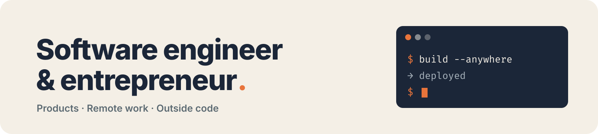

<picture>
  <source media="(prefers-color-scheme: dark)" srcset="assets/banner-dark.png">
  
</picture>

  
  
  
  

  I build software end to end, from the idea to production. 
  I work remotely while travelling, one country at a time.

## What I do

<table>
  <tr>
    <td width="33%" valign="top">
      <h3>Products</h3>
      SaaS, apps and tools I design, build and run end to end.
    </td>
    <td width="33%" valign="top">
      <h3>Remote work</h3>
      Open to IT roles and projects, from back-end and front-end to mobile, infrastructure and automation.
    </td>
    <td width="33%" valign="top">
      <h3>Outside code</h3>
      Sport, travel, food.
    </td>
  </tr>
</table>

## Stack I use most

TypeScript · NestJS · React · React Native · Next.js · PostgreSQL · Prisma · Redis · Docker

## Background

Epitech graduate (Master's level, 2026).

---

Most of my work is private for now. Ask me for a demo.

